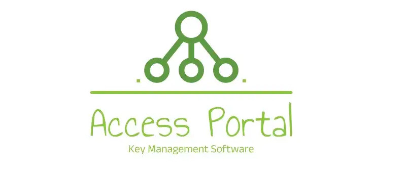

# Access Portal Backend build with <a href="https://www.django-rest-framework.org/" target="_blank">Django Rest Framework</a> and <a href="https://docs.celeryq.dev/en/stable/index.html" target="_blank"> Celery

<a href="https://access-portal-api-44e9247ddee5.herokuapp.com/api/v1" target="_blank">
    
</a>

## Overview

Access Portal is an Access Key Manager web application developed for Micro-Focus Inc. to manage access keys for their multi-tenant school management platform. Schools can use this application to purchase access keys to activate their accounts. This project involves building a key manager that includes user authentication, key management, and integration capabilities.

## Project Objective

Micro-Focus Inc., a software company, has built a school management platform that is multi-tenant. Various schools can set up on the platform as if it was built specifically for them. They have chosen to use an access key-based approach for monetization rather than integrating payment features directly into the software. This project aims to develop a web application that schools can use to purchase and manage access keys to activate their accounts.

## Major Features 🔑

### School IT Personnel

1. **`Signup & Login`**: School IT personnel is able to sign up and log in with an email and password. Account verification and a reset password feature to recover lost passwords is included.
2. **`Access Key Management`**: Users is able to see a list of all access keys granted: active, expired, or revoked.
3. **`Key Details`**: For each access key, users is able to see the status, date of procurement, and expiry date.
4. **`Key Constraints`**: Users should not be able to obtain a new key if an active key is already assigned. Only one key can be active at a time.

### Micro-Focus Admin

1. **`Admin Login`**: Admins is able to log in with an email and password.
2. **`Manual Key Revocation`**: Admins is able to manually revoke an access key.
3. **`Key Overview`**: Admins is able to see all keys generated on the platform, including their status, date of procurement, and expiry date.
4. **`Active Key LookUp Endpoint`**: Admins is able to access an endpoint that, given a school email, returns the status and details of the active key if any, or a 404 status if no active key is found. This allows integration with the school management software.

## Additions (top-ups)

1. School IT Personnel's key created must be activated by admin. Admins are `notified` via `email` if a key is created.
2. When status of a key changes, School IT Personnels are `alerted` via `email` by a custome mail template.
3. When creating a key, in addition to a `key-tag`, a user must input the `number of days` the key should be active which `starts at the time of activation` (procurement date).
4. A School IT Personnel can `delete` a key while the status is still `inactive` and also can `not create` a key while the status is `inactive`.

## System Credentials - Testing ⚙️

**Admin**

-   Email - `accessportalinfo@gmail.com`
-   Password - `admin`

**School IT Personnel(s)**

-   Email - `julius.markwei@stu.ucc.edu.gh`
-   Password - `guest@123`

---

-   Email - `tiktechgh@gmail.com`
-   Password - `guest@123`

---

-   Email - `juliussingh23k@gmail.com`
-   Password - `guest@123`

The project was inspired by the need for a robust and efficient way to manage access keys for a multi-tenant school management platform. Every aspect of this project required extensive research and careful planning to ensure seamless integration and functionality. The activities involved in this project are as follows:

1. Database model (table) development and configurations
2. Writing the various API views for all the neccessary methods of each view
3. Admin panel management configurations.
4. Adding all the neccesary URL endpoints to for all the various views and thier methods. Not forgetting the admin panel too.
5. Writing tests for all the views and thier methods. I also used Postman for testing as well.
6. Including a <a href="https://access-portal-api-44e9247ddee5.herokuapp.com/api/v1" target="_blank">documentation</a> for the project API through a library called <a href="https://drf-spectacular.readthedocs.io/en/latest/index.html" target="_blank">drf-spectacular</a> by <a href="https://www.openapis.org/" target="_blank">OpenAPI Initiative</a>.
7. Deployment of the REST API to <a href="https://www.heroku.com/" target="_blank">heroku</a>

## Image of the Browsable API

<a href="https://access-portal-api-44e9247ddee5.herokuapp.com/api/v1" target="_blank" title="Visit live">
    
</a>

## Technologies utilized in developing the system

1. <a href="https://www.django-rest-framework.org/" target="_blank">**Django rest Framework**</a> for handling API views, and routes.
2. <a href="https://docs.celeryq.dev/en/stable/index.html#" target="_blank">**Celery**</a> was utilized for managing and executing asynchronous background tasks, ensuring that long-running processes do not block the main application.
3. <a href="https://docs.celeryq.dev/en/stable/userguide/periodic-tasks.html" target="_blank">**Celery Beat**</a> was employed as a scheduler to automate the execution of periodic tasks, enabling tasks to run at defined intervals without manual intervention.
4. <a href="https://redis.io/" target="_blank">**Redis**</a> as a message broker for Celery to manage and schedule background tasks.
5. <a href="https://www.postgresql.org/" target="_blank">**Postgres Database**</a> as the primary database for storing application data securely and efficiently.
6. <a href="https://drf-spectacular.readthedocs.io/en/latest/index.html" target="_blank">**DRF Spectacular**</a> for generating and maintaining OpenAPI documentation for the Django REST Framework API.

## Frontend technoloies used

1. <a href="https://nextjs.org/" target="_blank">**Next.js**</a> for building the frontend, providing server-side rendering and static site generation for a seamless user experience.
2. <a href="https://vercel.com/" target="_blank">**Vercel**</a> was used host the frontend application, ensuring fast and reliable hosting with seamless integration for continuous deployment.

## Images of the Frontend

<h3>1. Admin View</h3>
<hr/>
<a href="https://access-portal-client.vercel.app/admin/dashboard" target="_blank" title="Admin panel"> 
</img>
</a>
<br/>
<h3>2. School IT Personnel View</h3>
<hr/>
<a href="https://access-portal-client.vercel.app/dashboard" target="_blank" title="School IT Personnel View"> 
</img>
</a>
<br/><br/>

-   Frontend repository can be found <a href="https://github.com/juliusmarkwei/access-portal-fe" target="_blank" title="frontend github repo"> <strong>`here`</strong><svg xmlns="http://www.w3.org/2000/svg" height="12px" width="30px" fill="red" viewBox="0 0 576 512"><path d="M64 0C28.7 0 0 28.7 0 64V352c0 35.3 28.7 64 64 64H240l-10.7 32H160c-17.7 0-32 14.3-32 32s14.3 32 32 32H416c17.7 0 32-14.3 32-32s-14.3-32-32-32H346.7L336 416H512c35.3 0 64-28.7 64-64V64c0-35.3-28.7-64-64-64H64zM512 64V288H64V64H512z"/></svg></a>

## Prerequisites

```
    python -> 3.10
    django -> 5.0.4
    djanforestframework -> 3.15.1
    celery -> 5.4.0
    redis -> 5.0.4
```

## Installation

1. #### Clone this repository

```
    git clone https://github.com/juliusmarkwei/access-portal.git
    cd access-portal/
```

2. #### Install all the neccessary packages/dependencies

```
    pip install -r requirements.txt
```

3. #### Environment Variables

-   Create a <strong>`.env`</strong> preferrably inside the root directory <strong>access-portal/</strong>. Inside the <strong>.env</strong> add a SECRET_KEY and your database configurations of the database of your choice. You can generate a <strong>`SECRET_KEY`</strong> using the following code snippet:

```
    from django.core.management.utils import get_random_secret_key
    print(get_random_secret_key())
```

-   Check the complete list of the <strong>`.env`</strong> file content <a href="https://textdoc.co/QYoKIEHRc0wF84MG" target="_blank">here</a>. It should look like the variables below:

```
    SECRET_KEY=your_secret_key_here
    DB_HOST=your_db_host
    DB_USER=your_db_user
    DB_PASSWORD=your_db_password
    DB_NAME=your_db_name
    DB_PORT=your_db_port
    DB_ENGINE=your_db_engine
```

4. In the root directory of the project, create a superuser to manage all the users of the application. be sure python is installed before you proceed with this stage.

```
    python3 manage createsuperuser
```

5. #### Run the program with the following command

```
    python3 manage runserver
```

6. #### Start the celery worker and celery beat

```
    celery -A core worker --loglevel=info
    celery -A core beat --loglevel=info
```

-   Make sure your redis server is up and running before you run the comand above.

## Get Involved

I welcome contributions and participation from the community to help make this backend API even better! Whether you're looking to fix bugs, add new features, or improve documentation, your help is greatly appreciated. Here's how you can get involved:

### Reporting Issues 🚩

If you encounter any bugs or issues, please report them using the <a href="https://github.com/juliusmarkwei/access-portal/issues"> Issues</a> section of my GitHub repository. When reporting issues, please include:

-   A clear and descriptive title.
-   A detailed description of the problem, including steps to reproduce it.
-   Any relevant logs or error messages.
    Your environment details (e.g., Django version, DRF version, database, etc.).

### Contributing Code 💁🏼

I love receiving pull requests from the community! If you have an improvement or a new feature you'd like to add, please feel free to do so 👍
